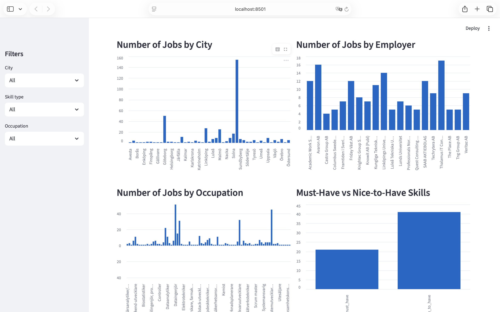
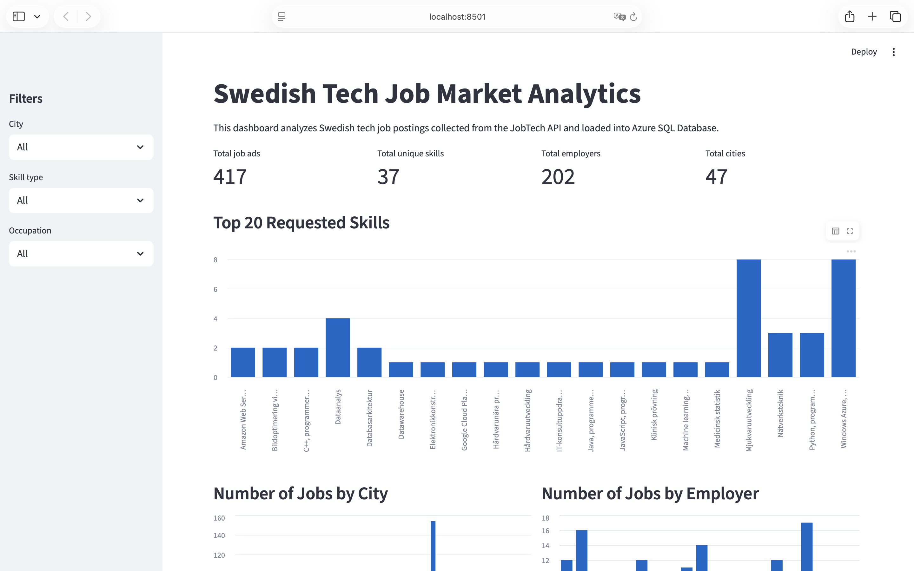

# Azure Job Market Data Pipeline

An end-to-end Azure data pipeline for analyzing Swedish tech job postings. The project extracts job ads from the Swedish JobTech API, transforms nested JSON into analytics-ready tables, uploads processed data to Azure Blob Storage, and loads the data into Azure SQL Database for querying.

This project is designed as a practical data engineering portfolio project, showing API ingestion, data transformation, cloud storage, relational loading, and SQL-based analytics.

## Architecture

```text
Swedish JobTech API
        |
        v
Python extraction script
        |
        v
Local raw JSON files
data/raw/
        |
        v
pandas transformation
        |
        v
Processed CSV tables
data/processed/
        |
        +----------------------+
        |                      |
        v                      v
Azure Blob Storage       Azure SQL Database
processed/*.csv          job_ads / skills / job_ad_skills
                               |
                               v
                         SQL analytics queries
```

## Project Screenshots

### Azure SQL Database



### Azure Storage / Pipeline Output



## Tech Stack

- Python
- pandas
- requests
- Azure Blob Storage
- Azure SQL Database
- SQLAlchemy
- pyodbc
- Streamlit
- SQL
- GitHub

## Folder Structure

```text
azure-job-market-data-pipeline/
├── azure/
│   ├── adf_pipeline_notes.md
│   └── architecture.md
├── dashboard/
│   └── powerbi_notes.md
├── data/
│   ├── raw/
│   └── processed/
├── sql/
│   ├── create_tables.sql
│   └── analytics_queries.sql
├── src/
│   ├── extract_jobs.py
│   ├── transform_jobs.py
│   ├── upload_to_blob.py
│   ├── load_to_sql.py
│   └── dashboard_app.py
├── main.py
├── requirements.txt
└── README.md
```

## Data Pipeline Steps

1. Extract job ads from the Swedish JobTech API using Python and `requests`.
2. Save raw API responses as JSON files in `data/raw/`.
3. Transform nested JSON into normalized CSV tables using `pandas`.
4. Save processed CSV files in `data/processed/`.
5. Upload processed CSV files to Azure Blob Storage under the `processed/` path.
6. Load processed CSV files into Azure SQL Database tables.
7. Run SQL analytics queries to explore Swedish tech job market trends.

## Database Schema Summary

### `job_ads`

Stores one row per job posting.

Key columns:
- `job_id`
- `title`
- `employer_name`
- `city`
- `region`
- `country`
- `occupation`
- `publication_date`
- `application_deadline`
- `description`
- `employment_type`
- `working_hours_type`
- `salary_type`
- `webpage_url`

### `skills`

Stores unique skills found in the job data.

Key columns:
- `skill_id`
- `skill_name`

### `job_ad_skills`

Bridge table connecting job ads to skills.

Key columns:
- `job_id`
- `skill_id`
- `skill_name`
- `skill_type`

## Example Analytics Questions

The project includes SQL queries in `sql/analytics_queries.sql` to answer questions such as:

- What are the top 20 most requested skills?
- Which Swedish cities have the most tech job postings?
- Which employers are hiring the most?
- Which occupations appear most often?
- What employment types are most common?
- How strong is the demand for Python, SQL, Azure, and Machine Learning skills?

## How to Run Locally

### 1. Create and activate a virtual environment

```bash
python3 -m venv .venv
source .venv/bin/activate
```

### 2. Install dependencies

```bash
pip install -r requirements.txt
```

### 3. Create a `.env` file

Create a `.env` file in the project root and add the required variables listed below. Do not commit real secrets to GitHub.

### 4. Run the extraction step

```bash
python3 src/extract_jobs.py
```

### 5. Run the transformation step

```bash
python3 src/transform_jobs.py
```

This creates:

- `data/processed/job_ads.csv`
- `data/processed/skills.csv`
- `data/processed/job_ad_skills.csv`

### 6. Upload processed files to Azure Blob Storage

```bash
python3 src/upload_to_blob.py
```

### 7. Load processed files into Azure SQL Database

```bash
python3 src/load_to_sql.py
```

### 8. Run analytics queries

Use the queries in:

```text
sql/analytics_queries.sql
```

These can be run in Azure Data Studio, SQL Server Management Studio, or the Azure Portal query editor.

## Interactive Dashboard

The project includes a Streamlit dashboard that connects directly to Azure SQL Database and visualizes the processed job market data.

Run the dashboard locally with:

```bash
streamlit run src/dashboard_app.py
```

The dashboard includes:

- KPI cards for total job ads, skills, employers, and cities
- Top requested skills
- Jobs by city, employer, and occupation
- Must-have vs nice-to-have skill demand
- Filters for city, skill type, and occupation
- A searchable job ads table with links to the original postings

## Environment Variables

The project uses a `.env` file for local configuration.

```env
AZURE_STORAGE_CONNECTION_STRING=your_azure_storage_connection_string
AZURE_CONTAINER_NAME=job-market-data

AZURE_SQL_SERVER=your_server_name.database.windows.net
AZURE_SQL_DATABASE=your_database_name
AZURE_SQL_USERNAME=your_username
AZURE_SQL_PASSWORD=your_password
AZURE_SQL_DRIVER=ODBC Driver 18 for SQL Server
```

The `.env` file is excluded from Git using `.gitignore`.

## Azure SQL Tables

The SQL table definitions are available in:

```text
sql/create_tables.sql
```

The current development loader uses `if_exists="replace"` when loading CSV files into Azure SQL. This keeps the pipeline simple for portfolio and development use by recreating tables from the latest processed CSV output.

## Future Improvements

- Add Azure Data Factory orchestration.
- Build a Power BI dashboard for job market insights.
- Automate the pipeline with a scheduled run.
- Add more advanced skill extraction from job descriptions.
